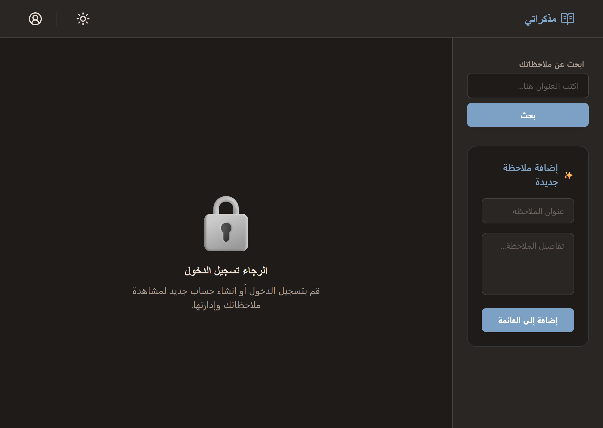

# 📝 Todo App

A modern, responsive task management application built with **React** (frontend) and **Node.js/Express** (backend). Perfect for organizing your daily tasks with a clean, intuitive interface.

---

## 🚀 Live Preview

* **Live Demo:** [https://your-app-link.vercel.app](https://your-app-link.vercel.app)
* **Production API:** [https://your-api-link.com/api](https://your-api-link.com/api)

---

## 🎯 Quick Overview

**Frontend:** React + Vite + Tailwind CSS  
**Backend:** Node.js + Express + MongoDB  
**Features:** User authentication, real-time task management, dark/light mode, responsive design

---

## 🖼️ Screenshots

### Desktop View


---

## ✨ Key Features

- ✅ **User Authentication** - Secure login & registration
- ✅ **Create, Read, Update, Delete** - Full task management
- ✅ **Dark/Light Mode** - Theme switcher for comfort
- ✅ **Responsive Design** - Works on desktop, tablet, mobile
- ✅ **Real-time Updates** - Instant UI feedback
- ✅ **Search** - Find tasks quickly
- ✅ **Rate Limiting** - API protection

---

## 📁 Project Structure

```
todo-app/
├── client/                 # React Frontend
│   ├── src/
│   │   ├── components/    # UI components
│   │   ├── services/      # API calls & utilities
│   │   └── main.jsx       # Entry point
│   └── package.json
│
├── server/                # Node.js Backend
│   ├── controllers/       # Business logic
│   ├── models/           # Database schemas
│   ├── routes/           # API endpoints
│   ├── middlewares/       # Middleware functions
│   └── package.json
│
└── documentation/                  # Documentation & screenshots
```

---

## 🚀 Getting Started

### Prerequisites
- **Node.js** v18+
- **npm** or **yarn**
- **MongoDB** (local or Atlas)

### Installation

**1. Clone the repository**
```bash
git clone <repository-url>
cd todo-app
```

**2. Backend Setup**
```bash
cd server
npm install
cp .env.example .env
# Edit .env with your MongoDB credentials
npm start
```

**3. Frontend Setup**
```bash
cd client
npm install
cp .env.example .env
# .env should have: VITE_API_BASE_URL=http://localhost:3000/api
npm run dev
```

**4. Access the app**
- Frontend: `http://localhost:5173`
- Backend API: `http://localhost:3000`

---

## 📚 Documentation

- [Client README](./client/README.md) - Frontend details, components, styling
- [Server README](./server/README.md) - Backend API, routes, database setup
- [Screenshots](./documentation/screenshots/) - UI previews (desktop, mobile, modals)

---

## 🔧 Tech Stack

| Layer | Technology |
|-------|-----------|
| Frontend | React, Vite, Tailwind CSS, Lucide Icons |
| Backend | Node.js, Express, MongoDB |
| Authentication | JWT (JSON Web Tokens) |
| Development | ESLint, npm scripts |

---

## 🔒 Security Features

- JWT-based authentication
- Rate limiting on API endpoints
- Input validation & sanitization
- Secure password handling
- Environment variables for sensitive data

---

## 📝 Available Scripts

### Frontend
```bash
npm run dev      # Start development server
npm run build    # Production build
npm run preview  # Preview production build
npm run lint     # Check code quality
```

### Backend
```bash
npm start        # Start server
npm run dev      # Development with auto-reload
```

---

## 🤝 Project Status

This is a **full-stack demo application** demonstrating modern web development practices including authentication, API design, responsive UI, and database management.

---

## 📧 Notes

- Uses localStorage for JWT token storage
- Fully responsive (mobile-first approach)
- Dark/Light mode toggle available
- All API responses follow REST conventions

---

**Built with ❤️ for task management**
